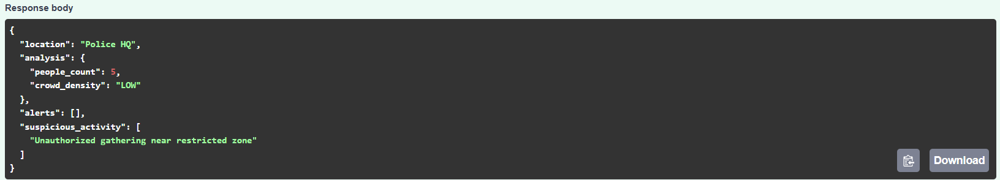
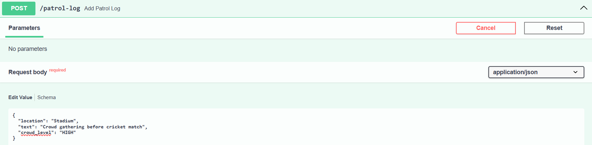
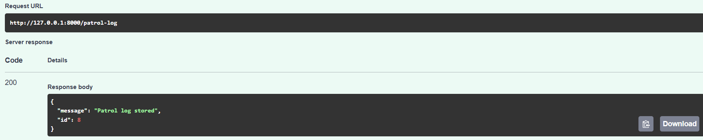
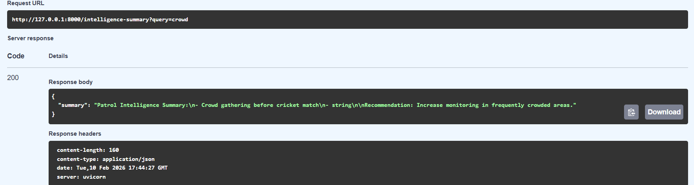

## CopMap AI Patrol & Bandobast Intelligence System

AI-driven patrol intelligence prototype that assists police operations by analyzing crowd activity, detecting potential risks, and generating patrol summaries using computer vision and retrieval-augmented intelligence.

## Problem Understanding

Police operations like **patrolling, bandobast deployment, and crowd monitoring** rely heavily on manual observation and reporting.

AI can realistically assist by:
* monitoring CCTV feeds
* estimating crowd density
* detecting unusual activity
* summarizing patrol logs
* generating deployment recommendations
However, AI should **assist officers, not replace decisions**, because:
* false positives can cause unnecessary deployment
* detection models are not always accurate
* operational context still requires human judgment
This system is designed as a **decision-support intelligence layer**, not an automated enforcement system.

## Where AI Fits in Police Operations

AI is useful for:
* crowd monitoring in public areas
* identifying congestion patterns
* summarizing patrol activity
* detecting risk indicators
AI should assist (not automate):
* arrests
* enforcement decisions
* emergency response actions

## System Architecture

## Architecture Overview

The system consists of five layers:
1. Camera/Image Input Layer
2. Computer Vision Layer (YOLO detection)
3. Alert & Suspicious Activity Engine
4. Backend Intelligence Service (FastAPI)
5. RAG Intelligence Layer (FAISS + embeddings)

## Technologies Used

* FastAPI
* YOLOv8 (Ultralytics)
* SentenceTransformers
* FAISS
* SQLite
* Python
## Features Implemented

### Crowd Analysis
YOLO model detects people and estimates crowd density.
### Object Detection
Person detection from uploaded images.
### Suspicious Activity Detection
Rule-based intelligence detects:
* late-night movement
* restricted-zone gatherings
* large crowd risk
### Automated Alerts
Alert engine generates warnings based on crowd metrics.
### Patrol Log Storage
Operational logs stored in SQLite database.
### RAG Intelligence Summaries
Patrol logs are embedded using SentenceTransformers and stored in FAISS.
Relevant logs are retrieved to generate intelligence summaries and recommendations.
## API Endpoints
POST /detect
POST /patrol-log
GET  /intelligence-summary

## Sample Outputs
POST /detect

POST /patrol-log

GET /intelligence-summary

---

## Trade-offs
This prototype prioritizes:
* clarity of architecture
* lightweight models
* offline execution
* cost-aware AI design
Skipped for simplicity:
* live CCTV streaming
* real-time deployment
* persistent vector DB
* complex behavior detection models
These would be added in a production system.

## What Was Implemented vs Skipped
### Implemented
* YOLO crowd detection
* Alert engine
* Suspicious activity detection
* Patrol log database
* RAG intelligence pipeline
* FastAPI backend
### Skipped
* frontend dashboard
* multi-camera streaming
* large-scale deployment
* advanced anomaly detection models

## Cost-Aware AI Design
This project uses:
* lightweight YOLO model (yolov8n)
* local embeddings model
* FAISS vector search
* SQLite storage
This keeps compute and API cost minimal.

## Repository Structure

app/
cv/
alerts/
rag/
db/
docs/
sample_data/

## Explanation Video

Video explanation: <https://drive.google.com/file/d/1Wto_njJGrYdsWcGNCIAbVpt4xe8IV8uV/view?usp=drive_link>

## Author

Pritish Kumar Lenka

